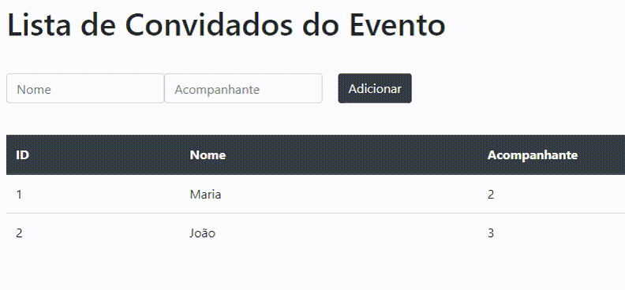

<h1 align="center">📑 Lista de Convidados para Evento</h1>

<h1 align="center">
    <a href="https://www.java.com/pt_BR/">☕ Java</a>
</h1>

Tela para cadastro de convidados

<h1>Conteúdos</h1>

 <a href="#objetivo">Objetivo</a> •
 <a href="#tecnologias">Tecnologias</a> • 
 <a href="#licenc-a">Licença</a> • 
 <a href="#autor">Autor</a>

<h4 align="center">
☕ Java Projetc em desenvolvimento ☕
</h4>

### Checklist

- [x] Cadastro inicial para teste e validação de Convidados
- [ ] Cadastro oficial com integração de API's
- [ ] Cadastro, mapeamento e validação de acompanhantes
- [ ] Validação dos acompanhantes
- [ ] Especificar o tipo como Encontro de Programadores baianos
- [ ] Identificar novas especificações a partir do tipo de evento escolhido

<h1 align="center">
    
</h1>

### Pré-requisitos 

Antes de tudo, além do conhecimento da linguagem Java, é preciso ter instalado o [JDK](https://www.oracle.com/java/technologies/javase/javase-jdk8-downloads.html), um empacotador de dependências e as dependências em si. Você pode vê-las na seção de Tecnologias Utilizadas. 
O processo de configuração na mão pode ser um pouco demorando. Para facilitar esse processo de configuração, entre no site do [Spring Initializr](https://start.spring.io/), escolha o tipo de projeto, defina o nome do projeto, escolha as dependências e exporte o projeto através de uma IDE.

Para não esquecer, baixe uma IDE. Você pode escolher entre o [Spring Tool Suite](https://spring.io/tools), [Eclipse](https://www.eclipse.org/downloads/), [NetBeans](https://netbeans.org/) e, o mais moderno [Intellij IDEA](https://www.jetbrains.com/pt-br/idea/) na versão Community. Se não curtiu esses, utilize qualquer outro do seu interesse. Lembre-se que a IDE é apenas uma ferramenta, o importante é ter uma base sólida do conhecimento para poder utilizar em qualquer ambiente.

### 🛠️ Tecnologias utilizadas

#### Conjunto de projetos
- Spring Boot
- Spring Data
- Spring MVC
- Spring Secutiry

#### Dependências e ferramentas
- MAVEN
- Spring Boot DevTools
- Spring Data JPA
- Spring Secutiry
- Biblioteca de template Thymealeaf
- Connector MySQL

### Jayneanderson Santos
---
 
  
 <b>Jayneanderson Santos</b></a> 

Aceita um café? Me mande uma mensagem.

 

